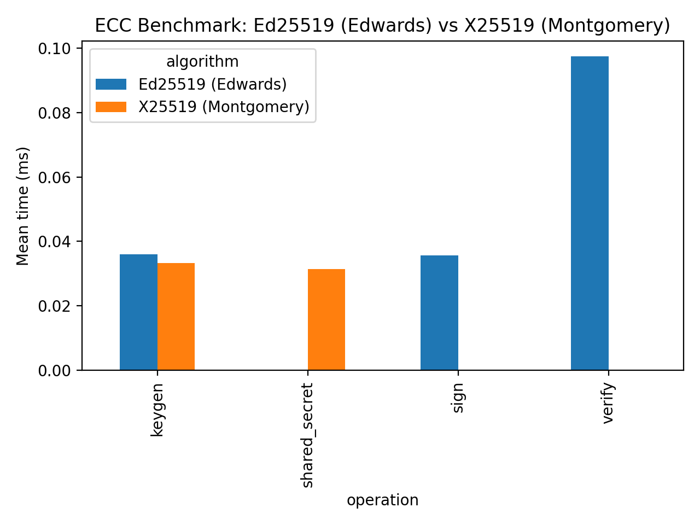

# Edwards vs. Montgomery Elliptic Curves — Ed25519 vs. X25519

> Comparative performance analysis of two elliptic-curve schemes on a common field. Bachelor thesis.

## Overview

A comparative study of **Ed25519** (Edwards curve, digital signatures) and **X25519** (Montgomery
curve, key exchange), both built on the shared **Curve25519** field. The thesis explains the
mathematical relationship between the two curve forms and benchmarks their practical performance.

## Approach

- Compared the two schemes on a common field: Ed25519 for signing/verification, X25519 for key exchange.
- **Benchmarked** signing, verification and shared-secret performance in **Python** under a controlled setup.
- Generated figures in **matplotlib** with a consistent style; written and typeset in **LaTeX**.

## Tools

Python · `cryptography` library · matplotlib · LaTeX

## Results

<!-- Add your benchmark numbers and the comparison chart -->
| Operation | Scheme | Mean time |
|-----------|--------|-----------|
| Sign | Ed25519 | <!-- e.g. ~0.038 ms --> |
| Verify | Ed25519 | <!-- e.g. ~0.116 ms --> |
| Shared secret | X25519 | <!-- e.g. ~0.037 ms --> |

-  

> Benchmarks run on: <!-- CPU / RAM / OS / Python & library versions -->

## Repository Structure

├── teza_finala.pdf            # full thesis
├── cod_v2.py                  # Python benchmarking scripts
├── bench_plot.png             # matplotlib outputs
└── README.md
```

## Skills Demonstrated

Applied cryptography · structured benchmarking methodology · Python · reproducible measurement ·
technical writing (LaTeX).

## Author

Andrei-Emanuel Popa · [andreipopae@gmail.com]
Supervisor: Ș.L. dr. ing. Alexandru Dinu — Politehnica Bucharest (ETTI)
